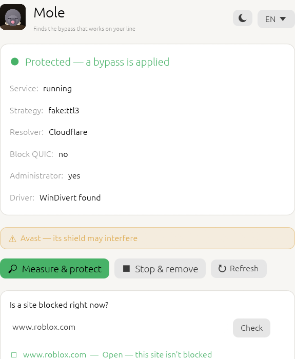

# Mole

*A Windows tool that gets past access blocks locally, and finds its own setting for your line.*

Mole's one-sentence goal: **you never pick a `.bat` again.** It measures what works on
your line, picks the winner, sits quietly as a service, repairs itself when it drops, and
tells you *why* when it can't get through. It is not a VPN — it does not route your traffic
through a foreign server; it only confuses the filter. Its first rule is **fail-open**: if
Mole stops, your internet keeps working.

See [Mole-Plan.md](../Mole-Plan.md) for the full design and reasoning.



## Status

Early. Building phase by phase; each phase leaves something that works on its own.

| Phase | What it delivers | State |
|-------|------------------|-------|
| **0. Foundation** | WinDivert integration, packet capture proof, admin/driver lifecycle | **done** |
| **1. Probe (CLI)** | Try the strategies, find and report the winner, say *why* | **done** |
| **2. Filter engine** | Desync strategies as pure, tested transforms; the live system-wide engine and `apply` | **done** (battery to grow) |
| **3. DNS (DoH)** | Get past DNS hijacking; correct resolution for the probe | **done** |
| **4. Service** | Self-healing Windows service, AV-conflict detection, `install`/`uninstall`/`status` | **done** |
| **5. UDP/QUIC** | Opt-in QUIC blocking to force TCP fallback (full desync later) | **first step done** |
| **6. Diagnostics + report** | "Why it failed" classification, privacy-preserving community report | **done** |
| **7. Polish** | Status-and-control GUI, bilingual README, release flow | **in progress** |

Every phase shares one engine: the probe applies each strategy through the *same*
`mole-core` code the live filter uses, so what it measures is what production does.
See [docs/findings.md](docs/findings.md) for what real lines actually did.

> **Live verification pending.** The measurement machinery, DoH, and parsers are
> tested and proven on this line. The service install/start/stop, `apply`, and the
> benign-decoy + TTL-sweep re-measurement still need one run in an elevated
> session — the build was written after admin rights lapsed here.

## Layout

- `mole-core` — the packet layer: WinDivert wrapper, IPv4/TCP/TLS inspection, the
  desync strategies, the live filter engine, config, and the Windows service.
- `mole-dns` — DoH resolver.
- `mole-probe` — measurement engine and the community report.
- `mole-cli` — the `mole` command line (`doctor`, `capture`, `dns`, `probe`,
  `apply`, `install`, `uninstall`, `status`, `report`).
- `mole-gui` — the status-and-control window (thin front over the CLI).
- `vendor/windivert` — the signed WinDivert 2.x DLL and driver (LGPL, see its LICENSE).

## Build & run

Requires Rust (MSVC toolchain) and administrator rights (WinDivert loads a kernel driver).

```
cargo build --release -p mole-cli
```

The runner looks for `WinDivert.dll` / `WinDivert64.sys` beside the executable, then in
`vendor/windivert/x64`, then wherever `MOLE_WINDIVERT_DIR` points. From an **elevated**
prompt:

```
mole doctor              # check admin, driver, and a live capture
mole capture             # sniff outbound ClientHellos, show their SNI (traffic untouched)
mole dns <host>          # resolve over DoH (bypasses DNS hijacking)
mole test <host>         # is a site reachable right now? (no admin needed)
mole probe [host ...]    # measure which bypass strategy works on this line
mole version             # print the version
```

`mole probe` resolves each target over DoH, then attempts a TLS handshake with no
help (the control) and once per strategy, watching for the server's reply. It
reports one of: *not blocked*, *bypass found* (naming the winning strategy), *IP
block* (a local tool can't help), or *DPI block, no bypass yet* — and tells the
difference by measuring, never guessing. A running GoodByeDPI/zapret/ByeDPI
service rewrites the same handshakes, so `probe` warns and you should stop it first.

The friendly way: double-click **`install.cmd`** (it asks for administrator, then
shows every step in the window — measures the line, picks the strategy, installs
the service). **`uninstall.cmd`** removes it the same way.

Or from a terminal:

```
mole install --auto      # probe, pick the winner, install the self-healing service
mole status              # what's running, and the chosen strategy
mole uninstall           # stop and remove, leaving nothing behind
```

Or, without a service, hold a strategy for one session:

```
mole apply --auto [--block-quic]   # probe, apply, and keep applying until Ctrl+C
```

`mole-gui` is a small window over the same commands: it shows the service state,
the chosen strategy, and any antivirus or rival tool in the way, with one button
to measure-and-protect (it asks for administrator through UAC), a live "is this
site blocked right now?" checker, light/dark and TR/EN, and a system-tray icon
(closing the window hides it to the tray).

**Self-healing:** the service quietly re-measures if its strategy stops working.
A health monitor watches a normally-blocked site through the running engine; if it
goes blocked, the operator has likely changed something, so the service re-probes
and switches to the new winning strategy on its own — no `.bat`, no reinstall.

`doctor` on this machine, with the driver installed and one HTTPS packet caught:

```
[ok]   administrator — running elevated
[ok]   WinDivert.dll — loaded
[ok]   driver — installed and capturing
[ok]   packet capture — 104.20.23.154:443  SNI example.com
```

## Note on running alongside GoodByeDPI

If GoodByeDPI (or any other DPI-bypass tool) is active, it splits ClientHello packets
before Mole's sniffer sees them, so `capture` will show fragments without a readable SNI.
Stop the other tool to see clean captures. Mole will manage this coexistence properly in a
later phase; two tools rewriting the same handshake fight each other.

## Known limits

- **IPv4 only** for now. The filter and probe parse IPv4/TCP; an IPv6 handshake
  passes through unshaped. Most Turkish DPI acts on IPv4, but dual-stack sites over
  IPv6 aren't yet covered.
- **QUIC** is sidestepped, not bypassed: `--block-quic` drops UDP :443 so browsers
  fall back to TCP. A full QUIC Initial desync is future work.
- **Bad-checksum decoys are unreliable where the NIC does TCP checksum offload** —
  the decoy gets repaired on the way out and reaches the server. The probe detects
  this (`handshake broke`) and prefers a TTL-based fake, so it doesn't affect the
  chosen strategy; it only narrows the battery on such machines.
- Not a VPN, not anonymity: Mole confuses the filter, it does not hide traffic. An
  IP-level block can't be passed locally — Mole says so rather than failing quietly.

## Legal

Using a bypass tool and publishing one under your own name are different things. This repo
starts **private** by choice; revisit when it matures.
