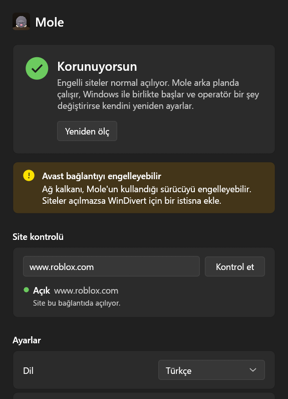

# Mole

*Türkiye'de erişim engellerini yerelde aşan, kendi hattına göre ayarını kendi bulan Windows aracı.*

Mole'un tek cümlelik hedefi: **bir daha `.bat` seçme.** Senin hattında ne
çalıştığını kendisi ölçer, çalışanı seçer, servis olarak sessizce oturur,
koptuğunda kendini onarır, aşamadığında da **sebebini** söyler. VPN değildir —
trafiği yurt dışından geçirmez; sadece filtreyi şaşırtır. En büyük ilkesi
**fail-open**: Mole dursa bile internetin kesilmez.

Tam tasarım ve gerekçeler için: [Mole-Plan.md](../Mole-Plan.md).



## Durum

Fazların çoğu bitti; her faz tek başına işe yarayan bir şey bırakıyor.

| Faz | Ne çıkar | Durum |
|-----|----------|-------|
| **0. Temel** | WinDivert entegrasyonu, paket yakalama kanıtı, yönetici/sürücü yaşam döngüsü | **bitti** |
| **1. Ölçüm (CLI)** | Stratejileri dene, kazananı bul ve *neden*ini söyle | **bitti** |
| **2. Filtre motoru** | Atlatma stratejileri saf/test edilmiş dönüşümler; canlı sistem-geneli motor ve `apply` | **bitti** (battery büyüyecek) |
| **3. DNS (DoH)** | DNS kaçırmayı aşma; probe için doğru çözümleme | **bitti** |
| **4. Servis** | Kendini onaran Windows servisi, AV çakışma tespiti, `install`/`uninstall`/`status` | **bitti** |
| **5. UDP/QUIC** | Opt-in QUIC engelleme (TCP'ye düşürme); tam desync sonraya | **ilk adım bitti** |
| **6. Teşhis + rapor** | "Neden çalışmadı" sınıflandırması, gizlilik-korumalı topluluk raporu | **bitti** |
| **7. Cila** | Durum-kontrol GUI'si, iki dilli README, sürüm akışı | **devam ediyor** |

> **Canlı doğrulama bekliyor.** Ölçüm makinesi, DoH ve ayrıştırıcılar bu hatta
> test edilip kanıtlandı. Servis kur/başlat/durdur, `apply`, ve iyi-huylu-sahte +
> TTL-tarama yeniden ölçümü elevated (yönetici) bir oturumda bir kez çalıştırmayı
> bekliyor — kod, buradaki yönetici hakkı düştükten sonra yazıldı.

## Kullanım

Yönetici hakkı gerekir (WinDivert bir çekirdek sürücüsü yükler).

**En kolay yol:** **`install.cmd`** dosyasına çift tıkla. Yönetici izni ister, sonra
her adımı pencerede gösterir — hattını ölçer, çalışan ayarı seçer, servisi kurar.
Kaldırmak için **`uninstall.cmd`**.

**Arkadaşına gönderirken:** `mole.exe` WinDivert'i içinde taşır ve ilk çalıştırmada
sürücüyü kendi yanına çıkarır; yani çalışması için en küçük set sadece **`mole.exe`,
`install.cmd` ve `uninstall.cmd`** — pencere de istersen +`mole-gui.exe`. (Klasörü
komple zip'leyip atmak da her zaman olur.)

Ya da terminalden:

```
mole install --auto      # ölç, kazananı seç, kendini onaran servisi kur
mole status              # ne çalışıyor, hangi strateji seçili
mole uninstall           # durdur ve kaldır, iz bırakmadan
```

Servissiz, tek oturumluk:

```
mole apply --auto [--block-quic]   # ölç, uygula, Ctrl+C'ye kadar sürdür
```

Tek komutlar:

```
mole doctor              # yönetici, sürücü ve canlı yakalama teşhisi
mole dns <host>          # DoH ile çöz (DNS kaçırmayı aşar)
mole test <host>         # bir site şu an erişilebilir mi? (yönetici gerekmez)
mole probe [host ...]    # bu hatta hangi stratejinin çalıştığını ölç
mole report              # her şeyi ölç, paylaşılabilir (gizlilik-korumalı) rapor yaz
mole version             # sürümü yazar
```

`mole-gui`, aynı komutların üstünde küçük bir penceredir: servis durumunu, seçili
stratejiyi ve yoldaki antivirüs/rakip aracı gösterir; tek tuşla ölç-ve-koru
(yönetici iznini UAC ile ister), canlı "bu site şu an engelli mi?" testi, açık/koyu
ve TR/EN, ve bir sistem tepsisi ikonu (pencereyi kapatınca tepsiye küçülür).

**Kendini onarma:** strateji çalışmayı bırakırsa servis sessizce yeniden ölçer.
Bir sağlık izleyicisi, çalışan motorun üstünden normalde engelli bir siteyi izler;
o site engellenirse operatör bir şey değiştirmiş demektir, servis yeniden ölçüp yeni
çalışan stratejiye kendi geçer — `.bat` yok, yeniden kurulum yok.

## GoodByeDPI ile birlikte çalıştırma

GoodByeDPI (ya da başka bir DPI atlatma aracı) açıksa, ClientHello paketlerini
Mole'un dinleyicisinden önce parçalar; bu yüzden `capture` okunabilir SNI olmadan
parçalar gösterir ve `probe`/`apply` uyarır. Temiz sonuç için ötekini durdur. İki
araç aynı el sıkışmayı yeniden yazınca birbiriyle kavga eder — birini tut.

## Bilinen sınırlar

- **IPv6** canlı filtre motorunda destekleniyor — ayrıştırma, split/decoy
  stratejileri (TTL yerine hop-limit, IPv6 pseudo-header checksum, IP başlık
  checksum'ı yok) ve motorun kendisi iki aileyi de işliyor; byte-byte birim
  testleriyle doğrulandı. **Canlı doğrulanmadı**: geliştiricinin hattında çalışan
  IPv6 yok, test edecek v6 trafiği yoktu. Probe ölçümü hâlâ IPv4 üzerinden yapar,
  motor seçilen stratejiyi v6 el sıkışmalarına da uygular.
- **QUIC aşılmıyor, yan geçiliyor:** `--block-quic` UDP :443'ü düşürür, tarayıcı
  TCP'ye döner. Tam QUIC desync sonraki iş.
- **Bozuk-checksum sahteleri, NIC checksum offload olan makinelerde güvenilmez** —
  decoy yolda düzeltilip sunucuya ulaşır. Probe bunu tespit eder (`handshake broke`)
  ve TTL tabanlı sahteyi tercih eder; yani seçilen stratejiyi etkilemez, sadece o
  makinelerde battery'i daraltır.
- VPN değil, anonimlik aracı değil: Mole filtreyi şaşırtır, trafiği gizlemez. IP
  seviyesindeki engel yerelde aşılamaz — Mole sessizce başarısız olmak yerine söyler.

## Yasal

Bir aracı kullanmak ile onu kendi adınla yayımlamak farklı şeylerdir. Bu depo
bilinçli olarak **private** başlıyor; olgunlaşınca yeniden değerlendirilir.
